# FoundersKingdom

<p align="center">
  <picture>
    <source media="(prefers-reduced-motion: reduce)" srcset="assets/hero/hero-reduced.svg">
    <source media="(prefers-color-scheme: light)" srcset="assets/hero/hero-light.svg">
    
  </picture>
</p>

<p align="center">
  <picture>
    <source media="(prefers-reduced-motion: reduce)" srcset="assets/hero/computational-dark.svg">
    <source media="(prefers-color-scheme: light)" srcset="assets/hero/computational-light.svg">
    
  </picture>
</p>

The startup operating system for founders building multiple ventures.

## Getting Started

First, run the development server:

```bash
npm run dev
```

Open [http://localhost:3000](http://localhost:3000) with your browser to see the result.

## Deployment

This project is configured to deploy to Vercel. Simply push to your main branch and Vercel will automatically build and deploy.

## Features

- Startup Portfolio Dashboard
- Multi-Startup Management
- Founder Workspace
- Startup Scoring System
- Relationship Mapping
- AI Startup Assistant

## How It Works

1. Create or import startups
2. Organize and score them
3. Connect ventures together
4. Track growth and momentum
5. Scale your startup ecosystem
